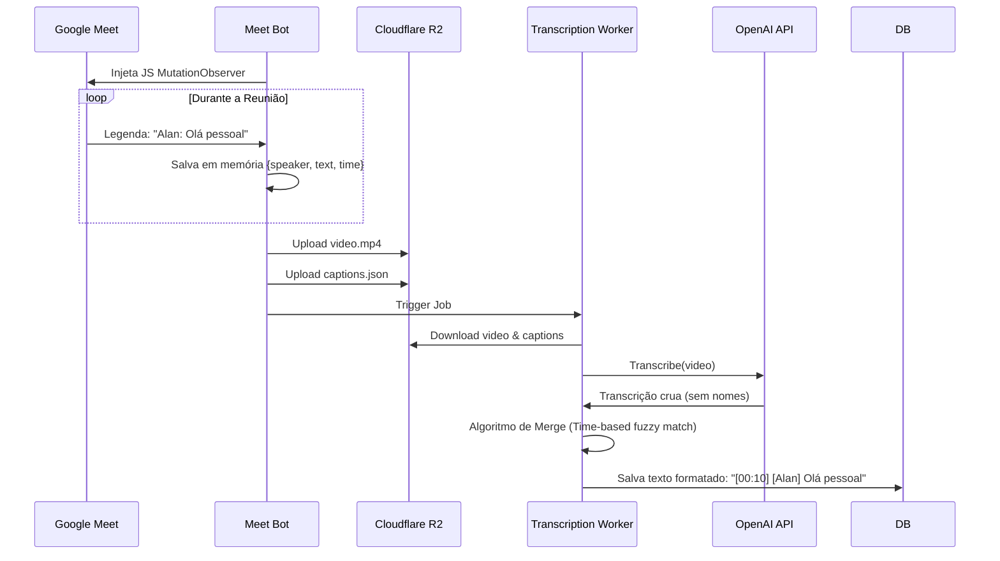

# Documentação para Desenvolvedores (Architecture Overview)

Este documento fornece uma visão técnica aprofundada da arquitetura do projeto **Meeting Assistant**. Ele foi projetado para ajudar novos desenvolvedores a entender como os serviços interagem, como o fluxo de dados funciona e onde encontrar funcionalidades específicas.

---

## 🏗️ Visão Geral da Arquitetura

O sistema é construído como uma aplicação distribuída baseada em microserviços (containers Docker), orquestrados via filas Redis.

### Diagrama de Container (C4 Level 2)

```mermaid
graph TD
    User((Usuário))
    
    subgraph "Frontend Layer"
        Web[Next.js App<br/>(Dashboard)]
    end
    
    subgraph "Data Layer"
        Supabase[(Supabase<br/>Postgres + Auth)]
        Redis[(Redis<br/>Message Queue)]
        R2[(Cloudflare R2<br/>Object Storage)]
    end
    
    subgraph "Backend Services"
        Scheduler[Scheduler Service<br/>(Python)]
        Orchestrator[Bot Orchestrator<br/>(Python)]
        Worker[Transcription Worker<br/>(Python)]
    end
    
    subgraph "Ephemeral Infrastructure"
        MetricBot1[Meet Bot Container 1<br/>(Python + Playwright)]
        MetricBot2[Meet Bot Container N...]
    end

    User -->|Acessa| Web
    Web -->|Lê/Escreve| Supabase
    Web -->|Enfileira Jobs| Redis
    
    Scheduler -->|Sync Calendar| Supabase
    Scheduler -->|Lista Eventos| GoogleAPI[Google Calendar API]
    Scheduler -->|Enfileira Join| Redis
    
    Orchestrator -->|Consome queue:join| Redis
    Orchestrator -->|Spawna| MetricBot1
    
    MetricBot1 -->|Entra| GMeet[Google Meet]
    MetricBot1 -->|Grava A/V| R2
    MetricBot1 -->|Upload Captions| R2
    MetricBot1 -->|Enfileira Transcrição| Redis
    
    Worker -->|Consome queue:transcribe| Redis
    Worker -->|Baixa Mídia| R2
    Worker -->|Gera Texto| OpenAI[OpenAI Whisper]
    Worker -->|Salva Resultado| Supabase
```

---

## 🧩 Detalhamento dos Serviços

### 1. **Frontend (`apps/web`)**
*   **Stack**: Next.js 16 (App Router), TailwindCSS, ShadcnUI.
*   **Função**: Interface do usuário para gerenciar reuniões, visualizar gravações e transcripts.
*   **Integração**:
    *   Conecta diretamente ao `Supabase` para dados.
    *   Conecta ao `Redis` (via API Routes) para disparar gravação manual.
    *   Usa `Server Actions` para mutações.

### 2. **Scheduler (`services/scheduler`)**
*   **Stack**: Python.
*   **Função**: Monitoramento proativo de agendas.
*   **Fluxo**:
    1.  Verifica banco de dados por usuários com tokens Google.
    2.  Sincroniza eventos do Google Calendar.
    3.  Identifica links do Google Meet.
    4.  Publica mensagens na fila `queue:join_meeting` minutos antes da reunião.

### 3. **Bot Orchestrator (`services/bot-orchestrator`)**
*   **Stack**: Python, Docker SDK.
*   **Função**: Gerenciador de frota de bots.
*   **Fluxo**:
    1.  Escuta `queue:join_meeting`.
    2.  Ao receber um job, verifica recursos e limites.
    3.  Usa o Docker Socket (`/var/run/docker.sock`) para iniciar um container `meet-bot` isolado para aquela reunião específica.
    4.  Monitora o ciclo de vida do container.

### 4. **Meet Bot (`services/meet-bot`)**
*   **Stack**: Python, Playwright, FFmpeg.
*   **Função**: "Headless" browser que participa da reunião.
*   **Comportamento**:
    *   **Stealth Mode**: Scripts avançados para evitar detecção de automação pelo Google.
    *   **Gravação**: Captura vídeo (canvas) e áudio do sistema.
    *   **Caption Scraping**: Injeta JavaScript na página para ler as legendas em tempo real (para identificar quem está falando).
    *   **Finalização**: Detecta fim da reunião, faz upload do `.mp4` e `captions.json` para o R2, e enfileira job de transcrição.

### 5. **Transcription Worker (`services/transcription-worker`)**
*   **Stack**: Python, OpenAI API, Pydub.
*   **Função**: Processamento assíncrono de mídia.
*   **Fluxo**:
    1.  Escuta `queue:transcription`.
    2.  Baixa o vídeo (`.mp4`) e as legendas (`.json`) do R2.
    3.  Envia áudio para OpenAI Whisper (modelo `whisper-1`) com timestamps.
    4.  **Speaker Attribution**: Cruza os timestamps do Whisper com as legendas coletadas pelo bot para atribuir nomes (`[Alan]: Olá`).
    5.  Salva o texto final no Supabase.

---

## 🔄 Fluxos de Dados Críticos

### Fluxo de Gravação Manual
1.  Usuário clica em "Gravar" no Dashboard.
2.  `Next.js` insere registro em `meetings` (status: `scheduled`) e envia job p/ Redis.
3.  `Orchestrator` pega job -> Inicia `meet-bot`.
4.  `meet-bot` atualiza status DB -> `joining` -> `recording`.
5.  `meet-bot` grava até o fim.
6.  `meet-bot` upload p/ R2 -> atualiza DB status -> `processing`.
7.  `meet-bot` envia job p/ Worker.

### Fluxo de Reconhecimento de Falantes


---

## 🗄️ Estrutura do Banco de Dados (Supabase)

Principais tabelas:

*   **`users`**: Usuários do sistema e tokens OAuth.
*   **`meetings`**: Registro central da reunião (URL, status, duração, título).
*   **`recordings`**: Metadados dos arquivos de vídeo no R2.
*   **`transcriptions`**: Texto completo processado.
*   **`transcription_segments`**: Segmentos detalhados (palavra por palavra) para recursos futuros de busca/edição.

---

## 🛠️ Tecnologias Chave & Decisões

*   **Redis como Backbone**: Desacopla o frontend dos processos pesados. Permite escalar workers horizontalmente.
*   **Playwright vs Selenium**: Playwright foi escolhido por melhor suporte a "stealth", gravação de vídeo (via cdp session) e velocidade.
*   **Docker-in-Docker (Orchestrator)**: O Orchestrator precisa ter acesso ao docker socket para criar bots dinamicamente. Isso permite isolamento total (se um bot travar, não derruba o sistema).
*   **Cloudflare R2**: Processamento de vídeo é caro em banda (egress). R2 tem taxa zero de egress, ideal para video streaming.

---

## 🐛 Pontos de Atenção para Manutenção

1.  **Google Meet UI Changes**: O `meet-bot` depende de seletores CSS (`src/bot.py`). Se o Google mudar o layout, o bot pode falhar ao entrar ou capturar legendas.
    *   *Solução*: Atualizar seletores em `bot.py` e `caption_scraper.py`.
2.  **OpenAI API Limits**: O worker processa arquivos grandes. Se o arquivo > 25MB, ele é quebrado em chunks (`src/transcriber.py`).
3.  **Timezones**: O `transcription-worker` faz cálculos de duração. Sempre use `datetime.now(timezone.utc)` para evitar erros de offset.

---

*Documentação gerada por Antigravity AI - Janeiro 2025*
