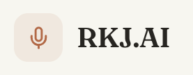
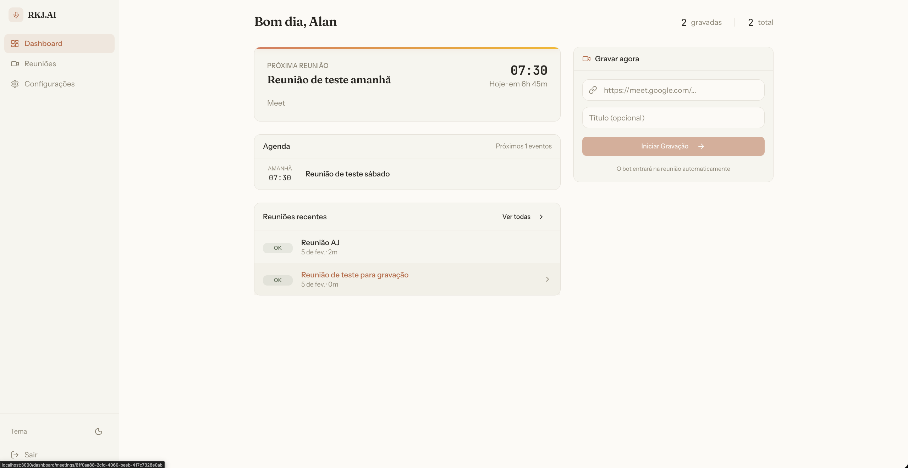
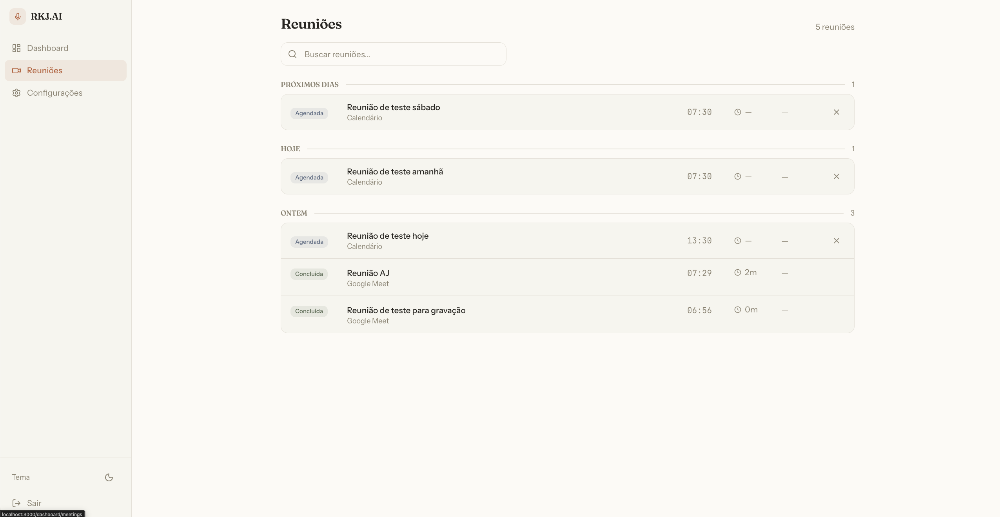
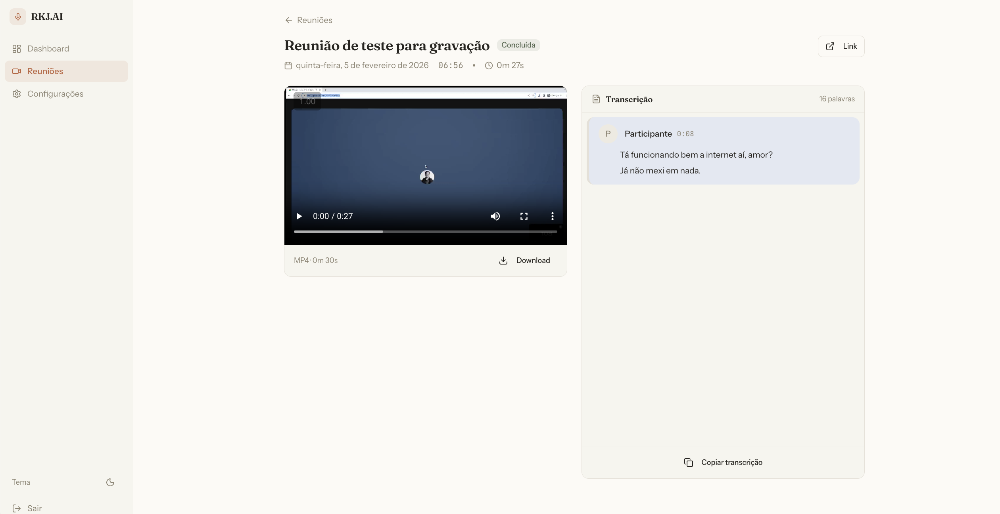
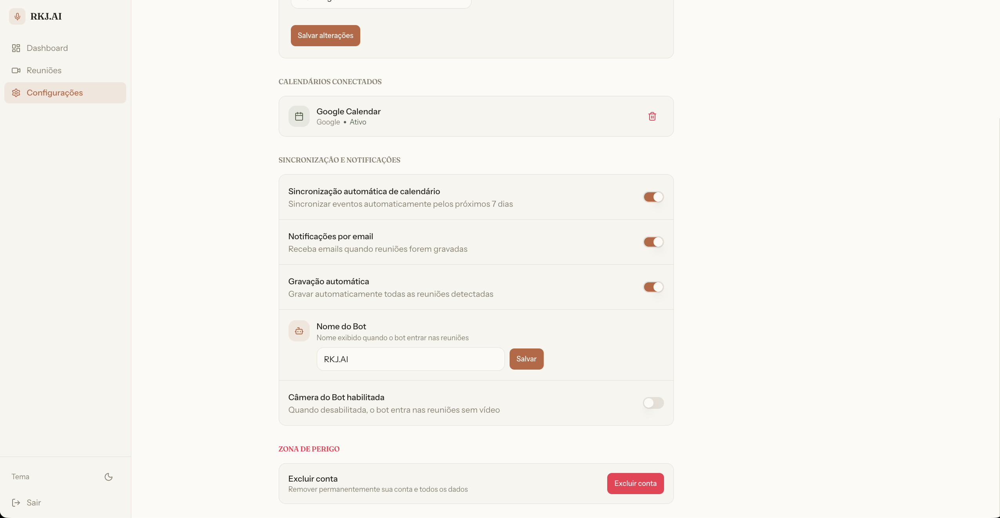

<div align="center">



# RKJ.AI

### Intelligent Meeting Assistant

**Automatically record and transcribe your Google Meet & Zoom meetings**

[](https://opensource.org/licenses/MIT)
[](https://nextjs.org/)
[](https://fastapi.tiangolo.com/)
[](https://python.org/)
[](https://www.typescriptlang.org/)
[](https://www.docker.com/)

[Features](#-features) • [Screenshots](#-screenshots) • [Architecture](#-architecture) • [Quick Start](#-quick-start) • [Deployment](#-deployment) • [API](#-api-documentation) • [Contributing](#-contributing)

</div>

---

## Overview

RKJ.AI is a self-hosted meeting assistant that automatically:

- **Syncs** with your Google Calendar
- **Joins** your Google Meet and Zoom meetings
- **Records** audio and video in high quality (1080p)
- **Transcribes** using OpenAI Whisper with speaker identification
- **Stores** everything securely in your own infrastructure

Think of it as your own private TLDV or Fireflies.ai — fully open source.

---

## Features

| Feature | Description |
|---------|-------------|
| **Calendar Sync** | Automatically detects meetings from Google Calendar |
| **Auto-Join Bot** | Bot enters meetings 2 minutes before start time |
| **HD Recording** | 1080p video + audio recording using FFmpeg |
| **AI Transcription** | OpenAI Whisper API with multi-language support |
| **Speaker ID** | Identifies who said what using live captions |
| **Full-Text Search** | Search across all your meeting transcriptions |
| **Export Options** | Download as TXT, SRT, VTT, or JSON |
| **Dark Mode** | Beautiful responsive UI with dark/light themes |
| **Self-Hosted** | Your data stays on your infrastructure |

### Status

| Component | Status |
|-----------|--------|
| Google Meet Bot | ✅ Fully working |
| Zoom Bot | 🚧 Planned |
| Google Calendar Sync | ✅ Fully working |
| OpenAI Transcription | ✅ Fully working |
| Speaker Diarization | ✅ Via live captions |
| AI Summaries | 🚧 Planned |

---

## Screenshots

### Dashboard


### Meetings


### Meeting Details & Transcription


### Settings


---

## Architecture

```
┌─────────────────────────────────────────────────────────────────────────────────┐
│                                   FRONTEND                                       │
│                              (Next.js 16 + Supabase Auth)                        │
│  ┌─────────────┐  ┌─────────────┐  ┌─────────────┐  ┌─────────────────────────┐ │
│  │  Dashboard  │  │  Calendar   │  │  Recordings │  │  Transcription Viewer   │ │
│  └─────────────┘  └─────────────┘  └─────────────┘  └─────────────────────────┘ │
└─────────────────────────────────────────────────────────────────────────────────┘
                                        │
                                        ▼
┌─────────────────────────────────────────────────────────────────────────────────┐
│                              BACKEND API (FastAPI)                               │
│                                                                                  │
│  ┌─────────────┐  ┌─────────────┐  ┌─────────────┐  ┌─────────────────────────┐ │
│  │  Calendar   │  │  Meetings   │  │  Recordings │  │    Transcriptions       │ │
│  │   Routes    │  │   Routes    │  │   Routes    │  │       Routes            │ │
│  └─────────────┘  └─────────────┘  └─────────────┘  └─────────────────────────┘ │
└─────────────────────────────────────────────────────────────────────────────────┘
                                        │
            ┌───────────────────────────┼───────────────────────────┐
            ▼                           ▼                           ▼
┌─────────────────────┐    ┌─────────────────────┐    ┌─────────────────────────┐
│   SCHEDULER         │    │   BOT ORCHESTRATOR  │    │  TRANSCRIPTION WORKER   │
│                     │    │                     │    │                         │
│ • Calendar Sync     │    │ • Bot Lifecycle     │    │ • OpenAI Whisper API    │
│ • Meeting Detection │    │ • Container Mgmt    │    │ • Speaker Attribution   │
│ • Job Scheduling    │    │ • Health Monitoring │    │ • Post Processing       │
└─────────────────────┘    └─────────────────────┘    └─────────────────────────┘
                                        │
                                        ▼
┌─────────────────────────────────────────────────────────────────────────────────┐
│                              BOT WORKERS (Docker)                                │
│  ┌───────────────────────────────┐    ┌───────────────────────────────────────┐ │
│  │      GOOGLE MEET BOT          │    │           ZOOM BOT (Planned)          │ │
│  │  • Playwright + Chrome        │    │  • Zoom Meeting SDK                   │ │
│  │  • FFmpeg Recording           │    │  • Native Recording                   │ │
│  └───────────────────────────────┘    └───────────────────────────────────────┘ │
└─────────────────────────────────────────────────────────────────────────────────┘
                                        │
                                        ▼
┌─────────────────────────────────────────────────────────────────────────────────┐
│                              MESSAGE QUEUE (Redis + BullMQ)                      │
│  ┌─────────────┐  ┌─────────────┐  ┌─────────────┐  ┌─────────────────────────┐ │
│  │join_meeting │  │  recording  │  │ transcribe  │  │     notification        │ │
│  └─────────────┘  └─────────────┘  └─────────────┘  └─────────────────────────┘ │
└─────────────────────────────────────────────────────────────────────────────────┘
                                        │
                                        ▼
┌─────────────────────────────────────────────────────────────────────────────────┐
│                                 DATA LAYER                                       │
│  ┌─────────────────────┐    ┌─────────────────────┐    ┌─────────────────────┐  │
│  │      SUPABASE       │    │   CLOUDFLARE R2     │    │       REDIS         │  │
│  │     PostgreSQL      │    │      Storage        │    │       Cache         │  │
│  │                     │    │                     │    │                     │  │
│  │ • Users & Auth      │    │ • Raw Recordings    │    │ • Session State     │  │
│  │ • Meetings          │    │ • Processed Media   │    │ • Bot Status        │  │
│  │ • Transcriptions    │    │ • Audio Files       │    │ • Job Queues        │  │
│  │ • Calendar Events   │    │ • Thumbnails        │    │                     │  │
│  └─────────────────────┘    └─────────────────────┘    └─────────────────────┘  │
└─────────────────────────────────────────────────────────────────────────────────┘
```

---

## Tech Stack

### Frontend

| Technology | Version | Purpose |
|------------|---------|---------|
| Next.js | 16 | React framework with App Router & Server Components |
| React | 19 | UI library |
| TypeScript | 5 | Type safety |
| Tailwind CSS | 4 | Styling |
| shadcn/ui | Latest | UI component library |
| Supabase SSR | 0.8 | Authentication & database client |

### Backend

| Technology | Version | Purpose |
|------------|---------|---------|
| FastAPI | 0.109 | Async Python web framework |
| Pydantic | 2.5 | Data validation |
| Supabase | 2.3 | Database & auth client |
| Redis | 5.0 | Job queues & caching |
| boto3 | 1.34 | S3/R2 storage client |
| OpenAI | 1.9 | Whisper transcription API |

### Infrastructure

| Technology | Purpose |
|------------|---------|
| Docker | Containerization |
| Traefik | Reverse proxy & auto SSL |
| Redis + BullMQ | Message queue |
| Cloudflare R2 | S3-compatible object storage |
| Supabase | PostgreSQL database + auth |

### Bot Technology

| Technology | Purpose |
|------------|---------|
| Playwright | Browser automation |
| FFmpeg | Video/audio recording |
| PulseAudio | Audio capture |
| Xvfb | Virtual display |

---

## Quick Start

### Prerequisites

- Docker & Docker Compose
- Node.js 20+
- Python 3.11+
- [Supabase CLI](https://supabase.com/docs/guides/cli/getting-started)

### External Services Required

| Service | Purpose | Sign Up |
|---------|---------|---------|
| Supabase | Database & auth | [supabase.com](https://supabase.com) |
| Cloudflare R2 | File storage | [cloudflare.com](https://cloudflare.com) |
| OpenAI | Transcription API | [platform.openai.com](https://platform.openai.com) |
| Google Cloud | OAuth & Calendar API | [console.cloud.google.com](https://console.cloud.google.com) |

### Installation

```bash
# 1. Clone the repository
git clone https://github.com/alanfrigo/rkj-ai.git
cd rkj-ai

# 2. Copy environment template
cp .env.example .env

# 3. Edit .env with your credentials
# See "Environment Variables" section below

# 4. Start all services
./scripts/dev.sh up
```

### Available URLs

| Service | URL |
|---------|-----|
| Frontend | http://localhost:3000 |
| API | http://localhost:8000 |
| API Docs (Swagger) | http://localhost:8000/docs |
| API Docs (ReDoc) | http://localhost:8000/redoc |
| Supabase Studio | http://localhost:54323 |
| Email Testing (Inbucket) | http://localhost:54324 |

### Development Commands

| Command | Description |
|---------|-------------|
| `./scripts/dev.sh up` | Start all services (Supabase + Docker) |
| `./scripts/dev.sh down` | Stop all services |
| `./scripts/dev.sh logs` | Follow all service logs |
| `./scripts/dev.sh logs api` | Follow specific service logs |
| `./scripts/dev.sh status` | Show service status |
| `./scripts/dev.sh build` | Rebuild all Docker images |
| `./scripts/dev.sh build-bot` | Rebuild meet-bot image only |
| `./scripts/dev.sh db:migrate` | Apply database migrations |
| `./scripts/dev.sh db:reset` | Reset database (destroys data) |
| `./scripts/dev.sh test` | Run tests |
| `./scripts/dev.sh api` | Run API in dev mode (hot reload) |
| `./scripts/dev.sh web` | Run frontend in dev mode |

---

## Environment Variables

Create a `.env` file from `.env.example`:

```env
# Supabase
SUPABASE_URL=https://your-project.supabase.co
SUPABASE_ANON_KEY=eyJ...
SUPABASE_SERVICE_KEY=eyJ...

# Cloudflare R2
R2_ACCOUNT_ID=your_account_id
R2_ACCESS_KEY_ID=your_access_key
R2_SECRET_ACCESS_KEY=your_secret_key
R2_BUCKET_NAME=meeting-assistant
R2_PUBLIC_URL=https://pub-xxx.r2.dev

# OpenAI
OPENAI_API_KEY=sk-...

# Google OAuth
GOOGLE_CLIENT_ID=xxx.apps.googleusercontent.com
GOOGLE_CLIENT_SECRET=xxx

# Redis
REDIS_URL=redis://localhost:6379

# Application
NEXT_PUBLIC_APP_URL=http://localhost:3000
API_URL=http://localhost:8000

# Bot Configuration
BOT_DISPLAY_NAME=RKJ.AI
BOT_JOIN_BEFORE_MINUTES=2
BOT_MAX_DURATION_HOURS=4
```

### Google Cloud Setup

1. Create a project at [Google Cloud Console](https://console.cloud.google.com)
2. Enable APIs:
   - Google Calendar API
   - Google People API
3. Create OAuth 2.0 credentials:
   - Application type: Web application
   - Authorized redirect URIs: `http://localhost:3000/callback`
4. Copy Client ID and Secret to `.env`

---

## Deployment

### Production Architecture

```
┌─────────────────────┐                 ┌─────────────────────────┐
│      VERCEL         │                 │         VPS             │
├─────────────────────┤                 ├─────────────────────────┤
│ • Next.js Frontend  │ ──────────────► │ • Traefik (SSL)         │
│ • CDN Global        │     HTTPS       │ • FastAPI (API)         │
│ • your-domain.com   │                 │ • Redis (Queue)         │
└─────────────────────┘                 │ • Bot Orchestrator      │
                                        │ • Transcription Worker  │
                                        │ • api.your-domain.com   │
                                        └─────────────────────────┘
```

### Backend Deployment (VPS)

**Requirements:**
- Ubuntu 22.04 or 24.04 LTS
- 8GB RAM minimum (32GB+ for multiple concurrent bots)
- DNS configured: `api.yourdomain.com` → VPS IP

```bash
# On your VPS
git clone https://github.com/your-username/rkj-ai.git
cd rkj-ai

# Configure environment
cp .env.example .env
# Edit .env with production values

# Add required production variables
echo "API_DOMAIN=api.yourdomain.com" >> .env
echo "ACME_EMAIL=your-email@domain.com" >> .env

# Deploy
sudo ./deploy.sh
```

The deploy script will:
1. Install Docker (if needed)
2. Configure UFW firewall (ports 22, 80, 443)
3. Build and start all containers
4. Configure Traefik with automatic Let's Encrypt SSL

### Frontend Deployment (Vercel)

1. Connect your repository to [Vercel](https://vercel.com)
2. Configure project:
   - **Framework:** Next.js
   - **Root Directory:** `apps/web`
3. Add environment variables:

| Variable | Value |
|----------|-------|
| `NEXT_PUBLIC_SUPABASE_URL` | `https://xxx.supabase.co` |
| `NEXT_PUBLIC_SUPABASE_ANON_KEY` | `eyJ...` |
| `NEXT_PUBLIC_APP_URL` | `https://yourdomain.com` |
| `NEXT_PUBLIC_API_URL` | `https://api.yourdomain.com` |

---

## Project Structure

```
rkj-ai/
├── apps/
│   ├── web/                    # Next.js 16 Frontend
│   │   ├── app/                # App Router pages
│   │   ├── components/         # React components
│   │   └── lib/                # Utilities & clients
│   │
│   └── api/                    # FastAPI Backend
│       ├── src/
│       │   ├── routers/        # API endpoints
│       │   ├── services/       # Business logic
│       │   ├── models/         # Pydantic models
│       │   └── core/           # Clients & config
│       └── requirements.txt
│
├── services/
│   ├── scheduler/              # Calendar sync & job scheduling
│   ├── bot-orchestrator/       # Docker container management
│   ├── meet-bot/               # Google Meet bot (Playwright)
│   └── transcription-worker/   # OpenAI Whisper processing
│
├── infrastructure/
│   ├── docker/
│   │   ├── docker-compose.yml      # Development
│   │   └── docker-compose.prod.yml # Production
│   └── supabase/
│       └── migrations/             # Database schema
│
├── scripts/
│   ├── dev.sh                  # Development helper
│   └── benchmark/              # Performance testing
│
├── deploy.sh                   # Production deployment
├── .env.example                # Environment template
└── README.md
```

---

## API Documentation

### Authentication

All API endpoints require authentication via Bearer token from Supabase Auth.

```bash
curl -H "Authorization: Bearer <token>" https://api.yourdomain.com/api/meetings
```

### Main Endpoints

| Method | Endpoint | Description |
|--------|----------|-------------|
| GET | `/api/meetings` | List all meetings |
| POST | `/api/meetings` | Create manual meeting |
| GET | `/api/meetings/{id}` | Get meeting with recordings & transcription |
| GET | `/api/calendar/events` | List calendar events |
| POST | `/api/calendar/sync` | Trigger calendar sync |
| GET | `/api/transcriptions/search?q=` | Search transcriptions |
| GET | `/api/transcriptions/{id}/export?format=srt` | Export transcription |
| GET | `/api/recordings/{id}/url` | Get presigned download URL |

### Full Documentation

- Swagger UI: `http://localhost:8000/docs`
- ReDoc: `http://localhost:8000/redoc`

---

## Database Schema

### Core Tables

| Table | Description |
|-------|-------------|
| `users` | User profiles (extends Supabase Auth) |
| `connected_calendars` | Linked Google/Outlook calendars |
| `calendar_events` | Synced calendar events |
| `meetings` | Recorded meeting sessions |
| `recordings` | Video/audio files metadata |
| `transcriptions` | Transcription content & metadata |
| `transcription_segments` | Individual speaker segments |
| `processing_jobs` | Async job tracking |

### Security

- **Row Level Security (RLS)** enabled on all tables
- Users can only access their own data
- Service role bypasses RLS for backend operations

---

## Workflow

```
1. User connects Google Calendar
   ↓
2. Scheduler syncs events (every 5 minutes)
   ↓
3. 2 minutes before meeting → Job queued
   ↓
4. Bot Orchestrator spawns Docker container
   ↓
5. Meet Bot joins meeting via Playwright
   ↓
6. FFmpeg records audio + video
   ↓
7. Meeting ends → Recording uploaded to R2
   ↓
8. Transcription Worker processes audio
   ↓
9. User accesses recording + transcription in dashboard
```

---

## Security Features

- **Authentication**: Supabase Auth with Google OAuth
- **Row Level Security**: PostgreSQL RLS on all tables
- **Rate Limiting**: Redis-based sliding window (100 req/min global, 200 auth)
- **Security Headers**: HSTS, X-Frame-Options, XSS protection via Traefik
- **Presigned URLs**: Time-limited access to recordings (5 min - 24 hours)
- **Encrypted Storage**: Refresh tokens encrypted at rest

---

## Contributing

Contributions are welcome! Please read our contributing guidelines before submitting PRs.

### Development Setup

1. Fork the repository
2. Create a feature branch: `git checkout -b feature/amazing-feature`
3. Make your changes
4. Run tests: `./scripts/dev.sh test`
5. Commit: `git commit -m 'Add amazing feature'`
6. Push: `git push origin feature/amazing-feature`
7. Open a Pull Request

---

## Roadmap

- [x] Google Calendar sync
- [x] Google Meet bot
- [x] HD video recording
- [x] OpenAI Whisper transcription
- [x] Speaker identification via captions
- [x] Full-text search
- [x] Export (TXT, SRT, VTT, JSON)
- [x] Dark mode
- [x] Rate limiting & security
- [ ] Zoom bot
- [ ] Advanced speaker diarization
- [ ] AI-generated meeting summaries
- [ ] Action items extraction
- [ ] Slack/Notion integrations
- [ ] Public API

---

## Disclaimer

This project uses browser automation to join meetings. Please ensure you:

- Have permission to record meetings
- Inform participants about the recording
- Comply with local privacy laws (GDPR, CCPA, etc.)

---

## License

This project is licensed under the MIT License - see the [LICENSE](LICENSE) file for details.

---

<div align="center">

**Built with love by [Alan Frigo](https://github.com/alanfrigo)**

[Report Bug](https://github.com/alanfrigo/rkj-ai/issues) • [Request Feature](https://github.com/alanfrigo/rkj-ai/issues)

</div>
