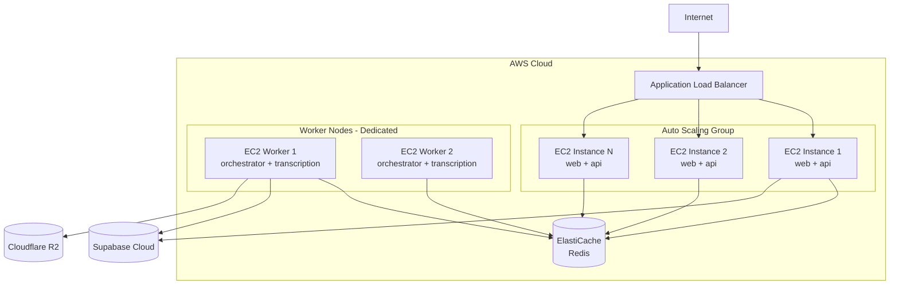

# AWS EC2 Deployment with Auto-Scaling (Future Guide)

Este guia documenta a arquitetura e os passos necessários para migrar a aplicação de uma VPS única para uma infraestrutura escalável na AWS usando **EC2**, **Auto Scaling Groups (ASG)** e **Application Load Balancer (ALB)**.

> [!NOTE]
> Este guia é para **referência futura**. A implementação atual usa uma VPS única com Traefik.

---

## 📋 Arquitetura de Produção (AWS)



---

## 1. Serviços AWS Necessários

| Serviço | Propósito | Tier Recomendado |
|---------|-----------|------------------|
| **EC2** | Instâncias de compute | `t3.xlarge` (4 vCPU, 16GB) ou maior |
| **ALB** | Load Balancer HTTP/HTTPS | Standard |
| **ASG** | Auto Scaling Group | Dynamic scaling |
| **ElastiCache** | Redis gerenciado | `cache.r6g.large` |
| **ECR** | Registro de imagens Docker | Standard |
| **ACM** | Certificados SSL | Gratuito |
| **Route 53** | DNS | Opcional (pode usar Cloudflare) |
| **CloudWatch** | Logs e Métricas | Standard |

---

## 2. Configuração Passo a Passo

### 2.1 Criar VPC e Subnets

1. Crie uma VPC dedicada (ex: `10.0.0.0/16`)
2. Crie pelo menos 2 subnets públicas em AZs diferentes
3. Crie 2 subnets privadas para workers e cache
4. Configure Internet Gateway e NAT Gateway

### 2.2 Configurar ElastiCache (Redis)

1. Crie um cluster Redis no ElastiCache
2. Escolha `cache.r6g.large` ou superior
3. Coloque em subnet privada com security group restrito
4. Anote o endpoint: `redis-cluster.xxxxxx.use1.cache.amazonaws.com:6379`

### 2.3 Criar Amazon ECR

1. Crie repositórios para cada imagem:
   - `rkj-web`
   - `rkj-api`
   - `rkj-orchestrator`
   - `rkj-transcription-worker`
   - `rkj-meet-bot`

2. Configure CI/CD para push automático (GitHub Actions):

```yaml
# .github/workflows/deploy.yml
name: Build and Push to ECR

on:
  push:
    branches: [main]

jobs:
  build:
    runs-on: ubuntu-latest
    steps:
      - uses: aws-actions/configure-aws-credentials@v4
        with:
          aws-access-key-id: ${{ secrets.AWS_ACCESS_KEY_ID }}
          aws-secret-access-key: ${{ secrets.AWS_SECRET_ACCESS_KEY }}
          aws-region: us-east-1

      - uses: aws-actions/amazon-ecr-login@v2

      - name: Build and push
        run: |
          docker build -t $ECR_REGISTRY/rkj-web:${{ github.sha }} ./apps/web
          docker push $ECR_REGISTRY/rkj-web:${{ github.sha }}
          # Repeat for other services...
```

### 2.4 Criar Launch Template

Crie um Launch Template para as instâncias EC2:

**User Data Script:**
```bash
#!/bin/bash
# Install Docker
curl -fsSL https://get.docker.com | sh

# Login ECR
aws ecr get-login-password --region us-east-1 | docker login --username AWS --password-stdin $ECR_REGISTRY

# Pull and run containers
docker pull $ECR_REGISTRY/rkj-web:latest
docker pull $ECR_REGISTRY/rkj-api:latest

# Run with env vars from SSM Parameter Store
docker run -d \
  --name rkj-web \
  -p 3000:3000 \
  -e REDIS_URL=$REDIS_ENDPOINT \
  $ECR_REGISTRY/rkj-web:latest

docker run -d \
  --name rkj-api \
  -p 8000:8000 \
  -e REDIS_URL=$REDIS_ENDPOINT \
  $ECR_REGISTRY/rkj-api:latest
```

### 2.5 Configurar Auto Scaling Group

1. Crie um ASG usando o Launch Template
2. Configure:
   - **Min**: 2 instâncias
   - **Max**: 10 instâncias
   - **Desired**: 2 instâncias
3. Configure políticas de scaling:
   - **Scale Out**: CPU > 70% por 5 min → +2 instâncias
   - **Scale In**: CPU < 30% por 10 min → -1 instância

### 2.6 Configurar Application Load Balancer

1. Crie um ALB em subnets públicas
2. Configure listeners:
   - **HTTP (80)** → Redirect to HTTPS
   - **HTTPS (443)** → Forward to Target Group
3. Crie Target Groups:
   - `rkj-web-tg` (porta 3000)
   - `rkj-api-tg` (porta 8000)
4. Configure regras de roteamento:
   - `api.domain.com/*` → `rkj-api-tg`
   - `*.domain.com/*` → `rkj-web-tg`

### 2.7 Configurar SSL com ACM

1. Solicite certificado no AWS Certificate Manager
2. Valide via DNS (adicione CNAME no Cloudflare/Route53)
3. Associe o certificado ao listener HTTPS do ALB

---

## 3. Workers (Orchestrator + Transcription)

> [!IMPORTANT]
> Os workers **NÃO devem escalar automaticamente** da mesma forma que web/api. Eles precisam de acesso ao Docker Socket e gerenciam recursos intensivos (gravação, transcrição).

### Arquitetura Recomendada

- 2-4 instâncias EC2 dedicadas (`c6i.2xlarge` ou `m6i.2xlarge`)
- **Não** usar ASG dinâmico - gerenciar manualmente ou com limite fixo
- Cada worker pode gerenciar ~10 bots simultâneos

### Configuração

1. Crie instâncias EC2 dedicadas para workers
2. Instale Docker e configure para rodar:
   - `rkj-orchestrator`
   - `rkj-transcription-worker`
3. Monte volume EBS para `/recordings`

---

## 4. Variáveis de Ambiente (AWS SSM)

Armazene secrets no **AWS Systems Manager Parameter Store**:

```bash
aws ssm put-parameter --name "/rkj/SUPABASE_URL" --value "https://xxx.supabase.co" --type SecureString
aws ssm put-parameter --name "/rkj/SUPABASE_SERVICE_KEY" --value "eyJ..." --type SecureString
aws ssm put-parameter --name "/rkj/OPENAI_API_KEY" --value "sk-..." --type SecureString
# ... outros secrets
```

No EC2 User Data, recupere com:
```bash
SUPABASE_URL=$(aws ssm get-parameter --name "/rkj/SUPABASE_URL" --with-decryption --query "Parameter.Value" --output text)
```

---

## 5. Monitoramento e Logs

### CloudWatch Logs

Configure o Docker para enviar logs ao CloudWatch:

```json
{
  "log-driver": "awslogs",
  "log-opts": {
    "awslogs-region": "us-east-1",
    "awslogs-group": "rkj-production",
    "awslogs-stream-prefix": "ecs"
  }
}
```

### CloudWatch Alarms

- **CPU > 80%** por 5 min → SNS Alert
- **Memory > 85%** → SNS Alert
- **ALB 5xx errors > 10/min** → SNS Alert
- **Healthy hosts < 2** → Critical Alert

---

## 6. Estimativa de Custos (us-east-1)

| Recurso | Especificação | Custo Mensal (est.) |
|---------|---------------|---------------------|
| EC2 (2x t3.xlarge) | Web/API | ~$240 |
| EC2 (2x c6i.2xlarge) | Workers | ~$490 |
| ElastiCache | cache.r6g.large | ~$200 |
| ALB | Standard | ~$30 |
| ECR | 50GB storage | ~$5 |
| Data Transfer | 500GB/mês | ~$45 |
| **Total** | | **~$1,010/mês** |

> [!TIP]
> Use **Reserved Instances** ou **Savings Plans** para reduzir custos em 30-60%.

---

## 7. Checklist de Migração

- [ ] Criar VPC e configurar networking
- [ ] Configurar ElastiCache Redis
- [ ] Criar repositórios ECR e configurar CI/CD
- [ ] Criar Launch Template com User Data
- [ ] Configurar ASG para web/api
- [ ] Configurar ALB com SSL
- [ ] Provisionar instâncias dedicadas para workers
- [ ] Migrar secrets para SSM Parameter Store
- [ ] Configurar CloudWatch Logs e Alarms
- [ ] Testar failover e scaling
- [ ] Atualizar DNS para apontar ao ALB
